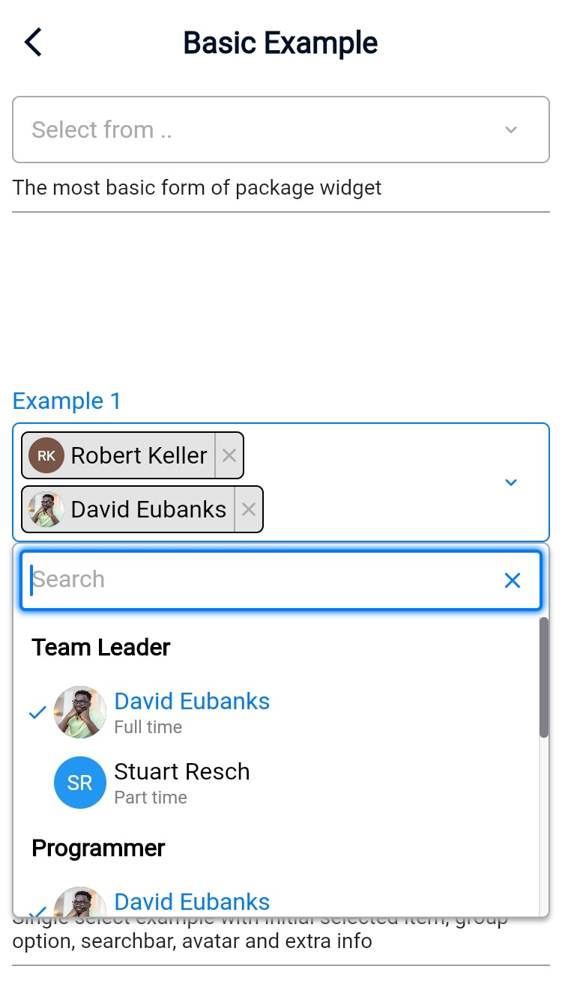
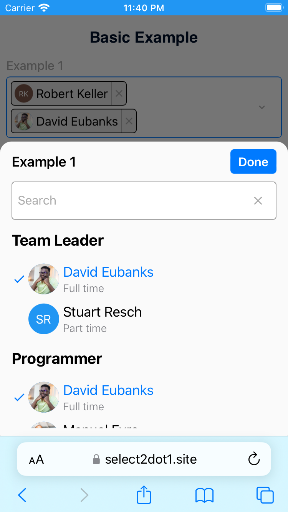

<!--
This README describes the package. If you publish this package to pub.dev,
this README's contents appear on the landing page for your package.

For information about how to write a good package README, see the guide for
[writing package pages](https://dart.dev/guides/libraries/writing-package-pages).

For general information about developing packages, see the Dart guide for
[creating packages](https://dart.dev/guides/libraries/create-library-packages)
and the Flutter guide for
[developing packages and plugins](https://flutter.dev/developing-packages).
-->
# Select2dot1

Select2dot1 give you a customizable single/multiple select box with support for 
searching, group option, extra info and avatar. Select2dot1 works using overlay
(web, desktop) and modal (mobile) and is fully customizable by settings and builder.

## Screenshots

Desktop and mobile version





## Getting started

### Installation

Add following dependency in pubspec.yaml file. And add this import to your file.

```bash
flutter pub add select2dot1
import 'package:select2dot1/select2dot1.dart';
```

### Usage

On the first step you need to create a list of data that you want to display in.

```dart
const List<SingleCategoryModel> exampleData1 = [
    SingleCategoryModel(
      nameCategory: 'Team Leader',
      singleItemCategoryList: [
        SingleItemCategoryModel(
          nameSingleItem: 'David Eubanks',
          extraInfoSingleItem: 'Full time',
          avatarSingleItem: CircleAvatar(
            backgroundColor: Colors.transparent,
            foregroundColor: Colors.transparent,
            backgroundImage: AssetImage('assets/images/avatar1.jpg'),
          ),
        ),
        SingleItemCategoryModel(
          nameSingleItem: 'Stuart Resch',
          extraInfoSingleItem: 'Part time',
          avatarSingleItem: CircleAvatar(
            backgroundColor: Colors.blue,
            child: Text('SR', style: TextStyle(color: Colors.white)),
          ),
        ),
      ],
    ),
```


Use Select2dot1 widget and pass your data to it.

```dart
Select2dot1(
    selectDataController: SelectDataController(data: ExampleData.exampleData1),
    scrollController: scrollController,
    ),
```
